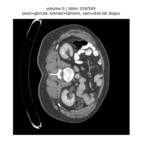
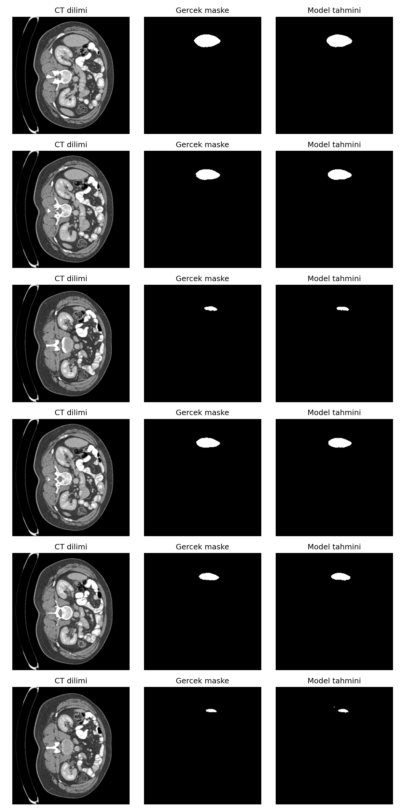

# Karaciğer Segmentasyonu: U-Net vs SegFormer (LiTS)

LiTS (Liver Tumor Segmentation Challenge) CT taramalarında 2D karaciğer
segmentasyonu. İki yaklaşım karşılaştırıldı:

1. **U-Net** — PyTorch ile sıfırdan yazıldı (skip connection'lar dahil), sıfırdan eğitildi.
2. **SegFormer-B0** — Hugging Face'ten önceden eğitilmiş (ADE20K) Transformer tabanlı model, fine-tuning ile uyarlandı.

Deneyler **MLflow** ile takip edildi; tahminler bir CT volume'u boyunca
dilim dilim oynatılarak **3D görselleştirme (GIF)** üretildi.



## Sonuçlar

Validation seti: 2 hasta (volume 9 ve 10), 1050 dilim.

| Model | Parametre | Epoch | Dice (tüm dilimler) | Dice (sadece karaciğerli dilimler) | Dice (aggregate) | IoU (aggregate) |
|---|---|---|---|---|---|---|
| **U-Net** (sıfırdan) | 31.0M | 25 | **0.985** | **0.957** | **0.977** | **0.954** |
| SegFormer-B0 (pretrained) | 3.7M | 15 | 0.975 | 0.926 | 0.967 | 0.935 |

**Üç farklı Dice neden var?**

- **Tüm dilimler:** Dilim başına Dice'ların ortalaması. Karaciğer içermeyen
  dilimlerde model "boş" dediğinde Dice ≈ 1 çıkar, bu da skoru şişirir.
- **Sadece karaciğerli dilimler:** Yalnızca gerçekten karaciğer içeren
  dilimler. En dürüst dilim bazlı metrik.
- **Aggregate:** Tüm validation setindeki piksel kesişim/birleşimleri
  toplanıp tek seferde hesaplanır (volume düzeyine en yakın ölçüm).

**Yorum:** U-Net, 8 kat daha fazla parametreyle ve daha uzun eğitimle
SegFormer-B0'ı geçti. SegFormer ise ~3.7M parametreyle yakın sonuç verdi
ve daha kararlı eğitildi: U-Net'in val IoU eğrisinde ani düşüşler var
(7. epoch'ta 0.39), SegFormer'ınki daha düzgün. Ayrıca SegFormer'ın çıktısı
girdinin 1/4 çözünürlüğünde üretilip büyütüldüğü için kenar detaylarında
dezavantajlı.



## Yöntem

**Ön işleme** (`src/preprocess.py`)
- NIfTI volume'ları 2D dilimlere ayrılıp `.npy` olarak kaydedildi (eğitimde her epoch NIfTI parse etmemek için).
- HU penceresi: [-200, 250] (karaciğer penceresi), ardından [0, 1]'e ölçekleme.
- Etiketler: karaciğer (1) ve tümör (2) birleştirilip **binary karaciğer maskesi** yapıldı.
- 256×256'ya yeniden boyutlandırma (maskede `INTER_NEAREST`).

**Veri ayrımı** (`src/dataset.py`)
- 11 volume kullanıldı: 9 train (4227 dilim), 2 validation (1050 dilim).
- Ayrım **hasta (volume) bazında** yapıldı. Komşu dilimler neredeyse aynı
  olduğu için dilim bazında rastgele ayrım veri sızıntısına yol açardı.

**Loss ve metrik** (`src/losses.py`)
- **Dice + BCE** birleşik loss: BCE eğitimi stabilize eder, Dice sınıf dengesizliğine (az karaciğer pikseli, çok arka plan) karşı dayanıklıdır.
- IoU metriği, en iyi model val IoU'ya göre seçildi.

**Eğitim**
- Google Colab T4 GPU, mixed precision (AMP), Adam optimizer.
- U-Net: lr 1e-4, batch 16, 25 epoch.
- SegFormer-B0: lr 6e-5, batch 8, 15 epoch. Gri CT dilimi 3 kanala kopyalanır, son katman `num_labels=1` ile değiştirilir, çıktı interpolate ile orijinal boyuta getirilir (`src/segformer_model.py`).

## Sınırlamalar

- **Ayrı bir test seti yok.** En iyi checkpoint validation IoU'ya göre seçildi
  ve raporlanan skorlar da aynı validation setinden. Bu yüzden sonuçlar
  hafif iyimser olabilir.
- **Validation sadece 2 hastadan oluşuyor.** Skorların hastalar arası
  varyansı ölçülmedi. Daha güvenilir bir karşılaştırma için k-fold
  (hasta bazlı) çapraz doğrulama gerekir.
- **2D yaklaşım.** Dilimler arası 3D bağlam kullanılmıyor (3D U-Net veya 2.5D girdi ile iyileştirilebilir).
- **Sadece karaciğer.** Tümör segmentasyonu (çok daha zor ve dengesiz bir görev) bu projenin kapsamı dışında.
- LiTS'in yalnızca küçük bir alt kümesi (11 volume) kullanıldı.

## Klasör yapısı

```
src/
  preprocess.py            NIfTI -> 2D .npy dilimler
  dataset.py               Dataset + hasta bazlı train/val ayrımı
  model.py                 U-Net (sıfırdan)
  segformer_model.py       SegFormer-B0 binary segmentasyon sarmalayıcısı
  losses.py                Dice + BCE loss, IoU metriği
  train.py                 U-Net eğitimi (MLflow loglamalı)
  train_segformer.py       SegFormer eğitimi
  evaluate.py              U-Net değerlendirme (3 farklı Dice/IoU)
  evaluate_segformer.py    SegFormer değerlendirme
  log_*_to_mlflow.py       Colab'de eğitilen modellerin sonuçlarını yerel MLflow'a kaydetme
  visualize.py             Örnek tahmin görselleri
  make_3d_gif.py           Volume boyunca dilim dilim GIF üretimi
notebooks/
  train_colab.ipynb            U-Net Colab eğitimi
  train_segformer_colab.ipynb  SegFormer Colab eğitimi
results/                   Tahmin görselleri ve GIF
```

`data/`, `checkpoints/`, `mlruns/` ve `mlflow.db` boyut nedeniyle repoya dahil değildir.

## Çalıştırma

```bash
pip install torch transformers nibabel opencv-python mlflow tqdm

# 1) LiTS verisini (Kaggle: "LiTS - Liver Tumor Segmentation") data/raw/extracted/ altına koy
python src/preprocess.py

# 2) Eğitim (GPU önerilir; Colab notebook'ları da kullanılabilir)
python src/train.py --epochs 25 --batch_size 16
python src/train_segformer.py --epochs 15 --batch_size 8

# 3) Değerlendirme ve görselleştirme
python src/evaluate.py
python src/make_3d_gif.py --volume_id 9 --checkpoint checkpoints/best_model.pth

# 4) Deneyleri karşılaştırma
mlflow ui --backend-store-uri sqlite:///mlflow.db
```

> ⚠️ Yalnızca eğitim/araştırma amaçlıdır, klinik kullanım için değildir.
